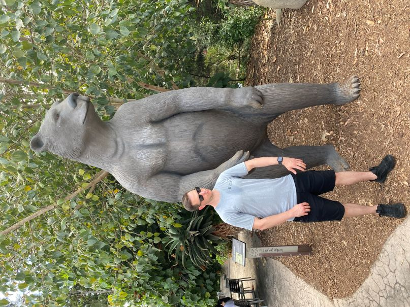

# BDA594-nthPerson GitHub Tutorial Repo for Web Excercise 1

## Required Content (Step 4 of Web Exercise 1)
**First and Last Name:** Robert Ashe  
**URL to BDA Class:** [BDA594 Canvas Page](https://sdsu.instructure.com/courses/186022)  
**My Definition of Big Data:** Data that is large in terms of volume, variety, and velocity. Big Data is often human-centered, geographical, temporal, dynamic, non-structured, noisy and error-prone, but extremely valuable and insightful for people and business.  
**Optional Image:** 